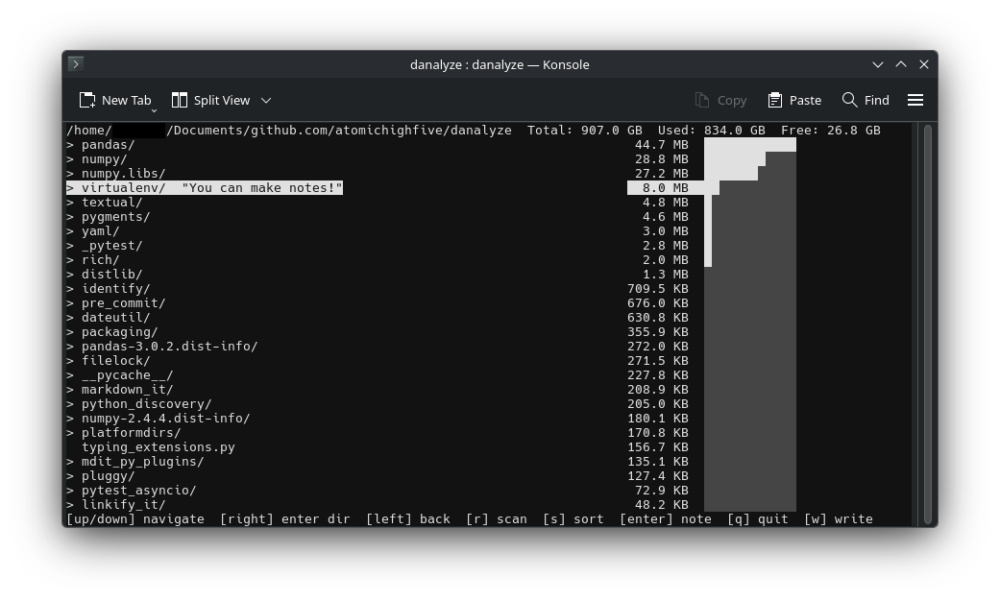

# danalyze



Terminal UI for analyzing disk space usage.

## Installation

Requires [uv](https://docs.astral.sh/uv/):

```bash
curl -LsSf https://astral.sh/uv/install.sh | sh
```

Install a specific release from a downloaded wheel:

```bash
uv tool install ./danalyze-1.0.0-py3-none-any.whl
```

Or install directly from the GitHub repo (always tracks the latest commit):

```bash
uv tool install "git+https://github.com/atomichighfive/danalyze"
```

Pin to a specific tag:

```bash
uv tool install "git+https://github.com/atomichighfive/danalyze@v1.0.0"
```

## Uninstall

```bash
uv tool uninstall danalyze
```

## Usage

```bash
danalyze                      # scan current directory
danalyze /some/path           # scan a specific path
danalyze --debug              # enable debug logging (writes danalyze.log)
danalyze -o notes.csv         # pre-load notes from a previous export
```

## Key bindings

| Key | Action |
|-----|--------|
| ↑ / ↓ | Navigate |
| → | Enter directory |
| ← | Go up |
| `r` | Scan sizes recursively |
| `s` | Toggle sort (alpha / size) |
| Enter | Add / edit note |
| `w` | Export notes to CSV |
| `q` | Quit |
